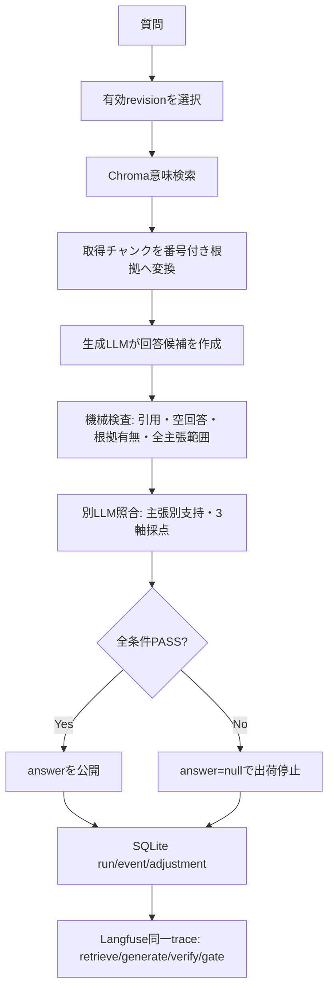

# アーキテクチャ

## 全体フロー

## コンポーネント

| 層 | 役割 |
|---|---|
| `src/ingest` | Markdown/Text/PDFの検査、読込、チャンク分割 |
| `src/rag` | E5埋め込み、Chroma検索、LangGraph retrieve/generate |
| `src/quality/verifier.py` | 決定論的検査、独立LLM照合、公開用サニタイズ |
| `src/quality/store.py` | SQLite schema、revision、run、job、event、adjustment |
| `src/quality/workbench.py` | revision別RAG、質問処理、比較・回帰job |
| `src/observability.py` | Langfuse trace ID、callback、verify/gate observation、着弾確認 |
| `src/api` | localhost向けAPIと4タブ業務UI |

## 永続化

`config/knowledge.toml`は初回登録に使う。運用開始後の有効ナレッジはSQLiteの`workbench_state`が指すrevisionで決まる。

revision本文は`data/runtime/revisions/{revision_id}/source/`へ不変スナップショットとして保存し、SHA-256で検査する。承認時には本文SHA、評価セットSHA、エンジンfingerprint、最新validation、却下状態を再確認する。

`events`はDB triggerでUPDATE/DELETEを拒否する。`runs`と`revisions`も不変。

## 品質ゲート

第一層は引用番号、引用網羅、根拠の存在、回答形式を検査する。第二層は生成とは別のLLM呼び出しで主張単位の支持・矛盾・判断不能と、根拠忠実性・質問直接性・誤情報なしを0〜2点で判定する。

全主張が支持され、主張範囲が回答全文を覆い、3軸すべて2点の場合だけ`released`。それ以外は`blocked`。

## 比較・承認

比較jobは1問、validation jobは設定済み評価セット全件を同じエンジン条件でbefore/after実行する。beforeは実行時点の有効revision、afterは候補revision。

既存released質問が1件でもblocked化した場合、全件がreleasedでない場合、評価セット・本文・エンジン設定が検証後に変わった場合は承認できない。

## セキュリティ境界

初期運用は`127.0.0.1`限定・1名・認証なし。Trusted Host、10MiBファイル上限、PDFページ/抽出文字上限、同時job上限、プロンプト内データ境界を実装している。

Langfuse有効時は監査情報がCloudへ送信される。個人情報・機密情報を扱う導入では、マスキング、保存地域・期間、権限、削除手順を別途実装する。
