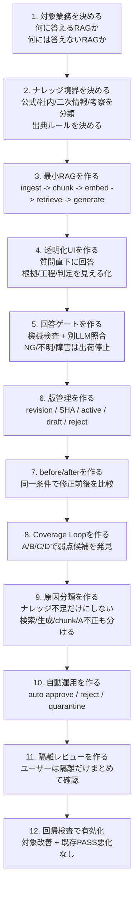
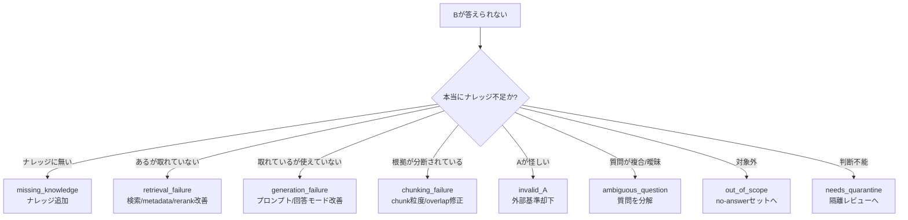
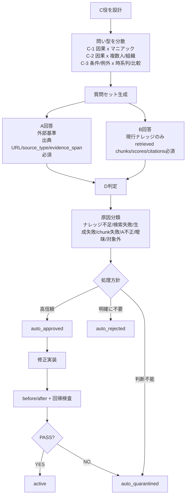
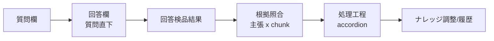
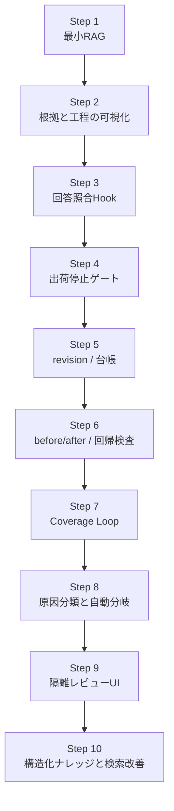
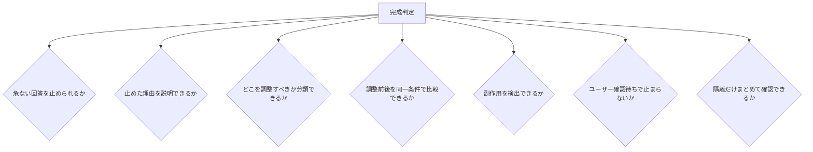

# RAG Quality Workbench Build Playbook

ここまでの議論と実装で見えてきた、RAG品質改善ワークベンチを構築する手順と勘所をまとめる。

目的は、特定ナレッジを作り込むことではない。任意ドメインで、RAGがどの問い型に弱いかを発見し、原因を分類し、止まらず改善を回す仕組みを作ること。

## 1. 全体構築フロー

## 2. 勘所つき詳細フロー

```mermaid
flowchart TD
    A["対象業務定義"] --> A1{"スコープは明確か?"}
    A1 -->|NO| A2["先にno-answer範囲を決める<br/>答えない質問も評価対象にする"]
    A1 -->|YES| B["ナレッジ設計"]
    A2 --> B

    B --> B1{"出典の強さを分類したか?"}
    B1 -->|NO| B2["source_typeを定義<br/>official / internal / primary / secondary / community / speculation"]
    B1 -->|YES| C["RAG基盤"]
    B2 --> C

    C --> C1{"検索根拠を説明できるか?"}
    C1 -->|NO| C2["chunk_id / source / score / snippet を必ず保存"]
    C1 -->|YES| D["回答ゲート"]
    C2 --> D

    D --> D1{"NG回答が漏れないか?"}
    D1 -->|NO| D2["fail-closed化<br/>判断不能・timeout・JSON破損もblocked"]
    D1 -->|YES| E["透明化UI"]
    D2 --> E

    E --> E1{"何をしたか見えるか?"}
    E1 -->|NO| E2["工程ごとに目的/入力/処理/出力/判断基準を保存"]
    E1 -->|YES| F["評価質問設計"]
    E2 --> F

    F --> F1{"質問役が偏っていないか?"}
    F1 -->|YES| F2["C役を複数軸に分ける<br/>因果/条件/例外/比較/曖昧/no-answer"]
    F1 -->|NO| G["Coverage Loop"]
    F2 --> G

    G --> G1{"Bの失敗原因を分けたか?"}
    G1 -->|NO| G2["missing_knowledge / retrieval_failure / generation_failure / chunking_failure / invalid_A へ分類"]
    G1 -->|YES| H["改善候補処理"]
    G2 --> H

    H --> H1{"ユーザー承認待ちで止まるか?"}
    H1 -->|YES| H2["自動採用/自動却下/隔離へ分岐<br/>隔離だけまとめて確認"]
    H1 -->|NO| I["before/after"]
    H2 --> I

    I --> I1{"改善と副作用を同時に見たか?"}
    I1 -->|NO| I2["対象質問 + 既存PASS質問を固定条件で再評価"]
    I1 -->|YES| J["active化"]
    I2 --> J
```

## 3. 一番重要な分岐

勘所はここ。Bが弱いからといって、すぐナレッジを足してはいけない。

RAG改善で失敗しやすいのは、検索やchunkが悪いだけなのに、本文を増やして解決しようとすること。これはナレッジ肥大化と検索ノイズを生む。

## 4. Coverage Loop構築フロー

## 5. UIを作る時の勘所

UIでやってはいけないこと:

- 処理工程に「何をするか」だけを書く。
- 類似度スコアだけで正確性を判断させる。
- NG時に候補回答を見せる。
- 根拠パネルをただのsource一覧にする。
- 非エンジニアにchunkやcommitを直接触らせる。

UIで必ず出すこと:

| 表示 | 理由 |
|---|---|
| 回答は質問直下 | 結果確認の視線移動を減らす |
| 出荷状態 | 回答可能/出荷停止/処理失敗を明確にする |
| 主張別根拠 | どの文がどのchunkに支えられているか見る |
| 工程accordion | 普段は簡潔、必要時だけ詳細を見る |
| NG工程の自動展開 | 止まった理由をすぐ分かるようにする |
| 調整履歴 | 何を変えたら結果がどう変わったか残す |

## 6. 構築順序の正解

重要なのは、Coverage Loopを最初に作らないこと。

先に、Bが何を検索し、何を根拠に、なぜ止まったかが見える状態を作る。これがないと、A/B/Dで差分が出ても、ナレッジ不足なのか検索失敗なのか分からない。

## 7. 完成形の判定基準

この7つを満たして初めて、納品できる仕組みに近づく。

単にRAGが回答するだけでは足りない。回答、検品、停止、原因分類、調整、比較、回帰、隔離運用までつながっていることが重要。

