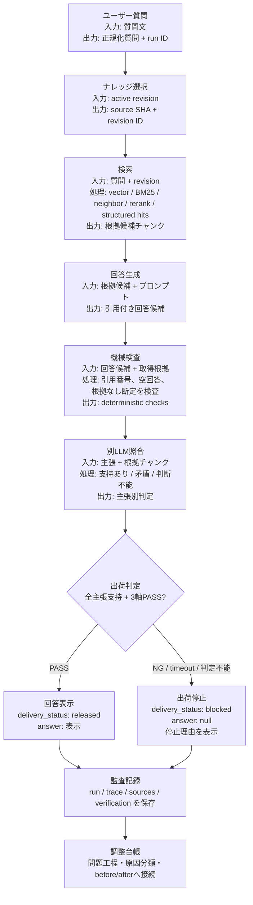
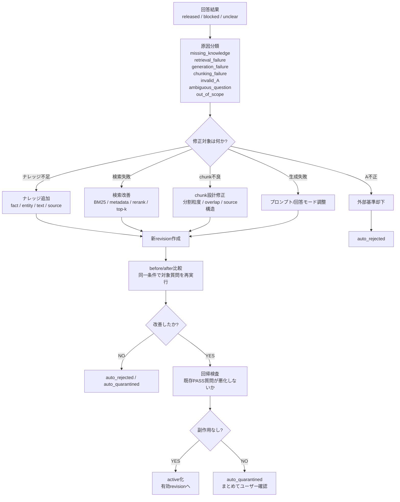
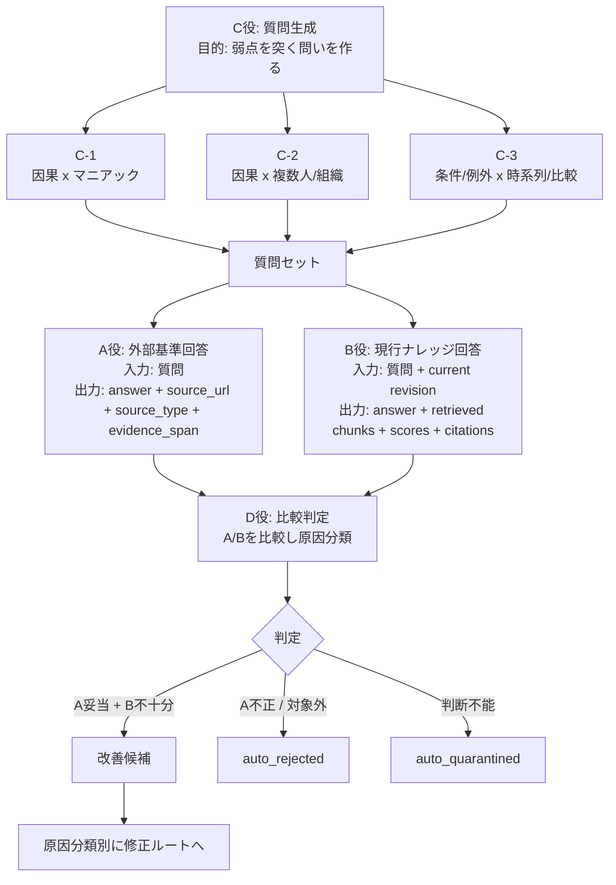
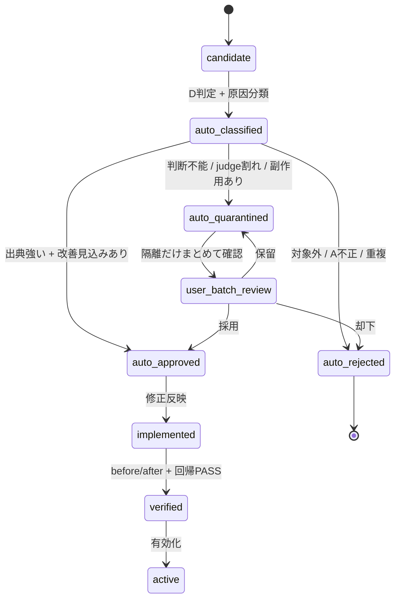
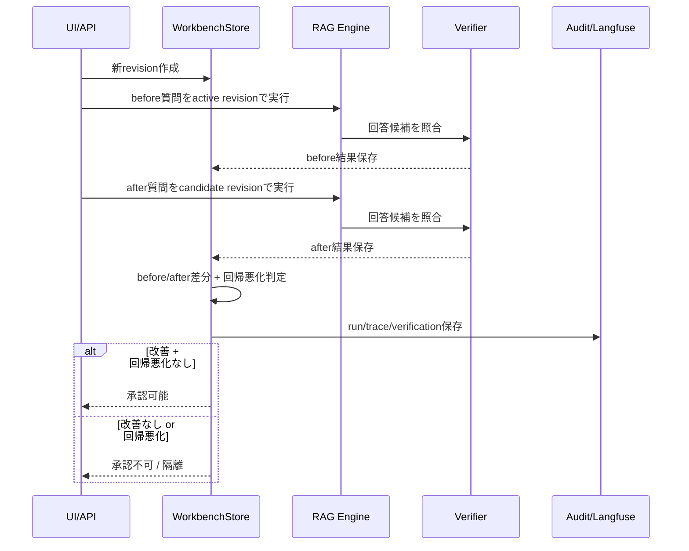

# medguide-rag Flow Diagram

この文書は、medguide-rag の処理工程をフロー図で説明します。

## 1. 全体フロー



### 読み方

| 工程 | 何をしたかを見る場所 | 止まる主な理由 |
|---|---|---|
| ユーザー質問 | 正規化後質問、run ID | 空質問、長すぎる質問 |
| ナレッジ選択 | revision ID、source SHA | revision不整合、source hash不一致 |
| 検索 | 取得チャンク、順位、score、snippet | 根拠0件、検索対象違い |
| 回答生成 | 回答候補、引用番号 | LLM障害、形式破損 |
| 機械検査 | 引用検査、根拠なし断定検査 | 壊れた引用、根拠なし断定 |
| 別LLM照合 | 主張別 support / contradiction / unclear | 矛盾、判断不能、JSON破損 |
| 出荷判定 | released / blocked | NG、timeout、検査エラー |
| 監査記録 | trace ID、Langfuse状態 | Langfuse未設定、送信失敗 |

## 2. ナレッジ改善フロー



### 重要な考え方

悪かった原因をすべて「ナレッジ不足」にしないこと。

RAGの失敗は、ナレッジ追加ではなく検索、chunk、プロンプトで直すべき場合があります。

## 3. Coverage Loop



### Dが出すべき分類

**実装済み**（2026-08-01）：`src/coverage_loop.py` の `FactCheckJudgment.failure_cause` と
`classify_coverage_item()`。ここに書かれている8分類はスキーマの型（`FailureCause`）として存在する。
下表の「次の行き先」列（自動採用/自動却下/隔離への振り分けロジック、台帳への永続化、
quarantine UI）はまだ未実装（`docs/handoff.md` の次回やる事を参照）。

| 分類 | 意味 | 次の行き先 |
|---|---|---|
| `missing_knowledge` | 必要情報がナレッジにない | ナレッジ追加 |
| `retrieval_failure` | あるのに検索できていない | retriever改善 |
| `generation_failure` | 根拠はあるが回答に使えていない | prompt/回答モード改善 |
| `chunking_failure` | 根拠が分割で壊れている | chunk設計修正 |
| `invalid_A` | 外部基準が弱い/誤り | 却下 |
| `ambiguous_question` | 質問が曖昧 | 質問分解 |
| `out_of_scope` | 対象外 | no-answerセット |
| `needs_quarantine` | 自動判断不能 | 隔離 |

## 4. 自動運用と隔離



### なぜ隔離だけユーザー確認にするのか

都度確認にすると改善が止まります。

そのため、通常候補は自動で進め、判断不能だけ隔離します。

ユーザーは、全件を見る作業者ではなく、例外だけを見る監査役です。

## 5. before/after 承認フロー



### 承認条件

| 条件 | 必須理由 |
|---|---|
| 対象質問が改善 | 修正目的を満たしたか |
| 既存PASS質問が悪化しない | 副作用防止 |
| 同一条件で比較 | 偶然の差分を避ける |
| trace保存 | 後から監査できる |

## 6. UIで見せるべき順序

```text
1. 稼働状態・使用ナレッジ
2. 質問欄
3. 回答欄
4. 回答検品結果
5. 根拠照合
6. 処理工程
7. ナレッジ調整・履歴
```

回答欄は質問欄の直下に置きます。

処理工程は通常は工程名と状態だけを見せ、展開時に以下を表示します。

- 目的
- 入力
- 実行した処理
- 処理後の出力
- 判断基準

NG工程は自動展開します。

